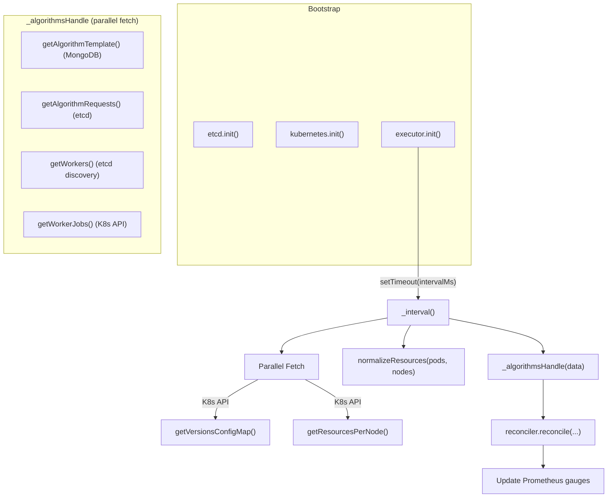
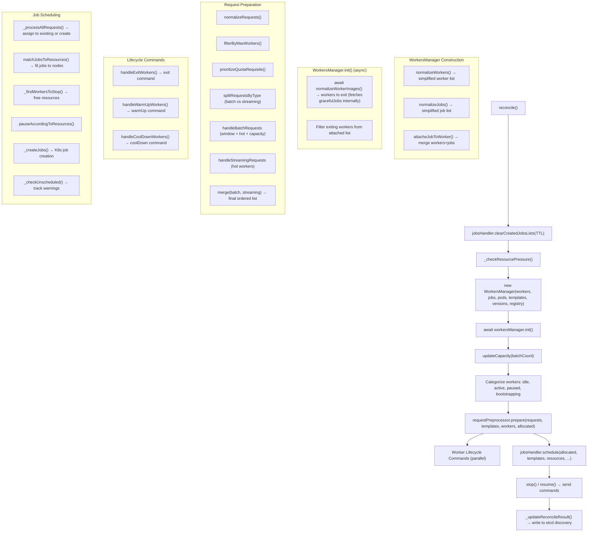

# task-executor — Reverse-Spec Discovery

> **Version:** 2.11.0  
> **Package:** `task-executor`  
> **Purpose:** Periodic reconciliation engine that observes algorithm requests (from resource-manager), worker registrations (etcd discovery), algorithm templates (MongoDB), and Kubernetes cluster state to **create, stop, resume, and exit worker pods** — bridging desired scheduling state with actual infrastructure.

---

## 1. Service Identity

| Property | Value |
|---|---|
| Entry Point | `app.js` → `bootstrap.js` |
| Runtime | Node.js |
| Pattern | Timer-driven control loop (singleton `Executor`), Manager/Strategy pattern for workers, jobs, and requests |
| Persistence Owned | etcd: `discovery` (reconcile results, node stats, worker stats) |
| Persistence Observed | etcd: `algorithms.requirements` (from resource-manager), `discovery` (workers) · MongoDB: `algorithms` collection · Kubernetes API: nodes, pods, jobs, configMaps, PVCs, secrets, CRDs |
| Side Effects | Creates/deletes Kubernetes Jobs (worker pods), sends commands to workers via etcd (`exit`, `stopProcessing`, `startProcessing`, `warmUp`, `coolDown`) |

---

## 2. Structural Overview

```
task-executor/
├── app.js                          # Process entry
├── bootstrap.js                    # Init: etcd, kubernetes, executor
├── config/main/
│   └── config.base.js              # Interval, resources, K8s, etcd, DB config
├── lib/
│   ├── executor.js                 # Core timer loop (_interval)
│   ├── consts/                     # Constants: commands, thresholds, containers
│   ├── helpers/
│   │   ├── etcd.js                 # etcd + MongoDB client (templates, workers, requests)
│   │   ├── kubernetes.js           # K8s client (jobs, pods, nodes, configmaps, volumes)
│   │   └── settings.js             # Global runtime settings (useResourceLimits, applyResources)
│   ├── reconcile/
│   │   ├── reconciler.js           # Top-level reconcile() orchestrator
│   │   ├── normalize.js            # Data normalization (workers, jobs, resources, images)
│   │   ├── createOptions.js        # Image resolution & container resource creation
│   │   ├── resources.js            # Resource matching, node scheduling, pause logic
│   │   └── managers/
│   │       ├── workers.js          # WorkersManager: state categorization, lifecycle commands
│   │       ├── jobs.js             # JobsHandler: scheduling, job creation, stop/resume
│   │       └── requests.js         # RequestPreprocessor: prioritization, windowing, capacity
│   ├── jobs/
│   │   └── jobCreator.js           # Kubernetes Job spec builder
│   └── templates/                  # K8s manifest templates (worker, sidecar, etc.)
```

---

## 3. Core Logic Loop

The service is a **headless daemon** with a health-check HTTP endpoint. A single `setTimeout` chain drives the control loop.



### Cycle Timing
- **Interval:** `config.intervalMs` (default **3000 ms**)
- **Guard:** `try/catch` + `finally` ensures next tick always fires
- **Health:** `/healthz` checks `Date.now() - _lastIntervalTime < maxDiff` (default 10s)

---

## 4. Reconciliation Loop — Decision Flow



---

## 5. State Sources

| Source | Data | Method | Cache TTL |
|---|---|---|---|
| **MongoDB** (`algorithms` collection) | Algorithm templates (cpu, mem, gpu, image, version, minHotWorkers, maxWorkers, quotaGuarantee, stateType, nodeSelector, mounts, etc.) | `etcd.getAlgorithmTemplate()` | 2000 ms |
| **etcd** (`algorithms.requirements`) | Scored & prioritized algorithm requests from resource-manager | `etcd.getAlgorithmRequests()` | none |
| **etcd** (`discovery`) | Registered worker states (workerId, algorithmName, workerStatus, workerImage, algorithmVersion, hotWorker, podName) | `etcd.getWorkers()` | 1000 ms |
| **Kubernetes Jobs API** | Worker jobs (active, succeeded, failed, metadata labels) | `kubernetes.getWorkerJobs()` | 1000 ms |
| **Kubernetes Nodes/Pods API** | Cluster capacity (cpu, memory, gpu per node), pod resource requests | `kubernetes.getResourcesPerNode()` | 1000 ms |
| **Kubernetes ConfigMap** (`hkube-versions`) | Container image versions & registry info | `kubernetes.getVersionsConfigMap()` | 5000 ms |
| **Kubernetes PVCs/ConfigMaps/Secrets** | Volume availability for algorithm mounts | `kubernetes._getAllVolumeNames()` | per-tick |
| **Kubernetes CRDs** (Kai Queues) | Valid queue names for KAI scheduling | `kubernetes.getAllQueueNames()` | per-tick |

### State Sovereignty
- **Owns:** etcd discovery registration (reconcile results, node stats, worker stats, unscheduled warnings, resource pressure data)
- **Observes:** Everything else (algorithm templates, algorithm requirements, worker registrations, K8s infrastructure state)

---

## 6. Decision Matrix — `normalizeWorkerImages` (async)

This function determines which running workers must be **force-exited** due to configuration drift. It is **async** and internally fetches graceful jobs from etcd.

```
INPUT: normalizedWorkers, algorithmTemplates, versions, registry
       (gracefulJobs fetched internally from etcd)

  0. Derive unique algorithmNames from normalizedWorkers
     Fetch gracefulJobs = await etcd.getAllGracefulJobs(algorithmNames)

For each worker WHERE workerStatus ≠ 'exit':
  1. Look up algorithm template by worker.algorithmName
  2. If template not found → skip (worker may belong to deleted algorithm)
  
  3. Compute expected workerImage:
     - If template.workerImage set → use it (with registry)
     - Else → resolve 'hkube/worker' from versions configmap + registry
  
  4. CHECK: workerImage !== worker.workerImage
     → message = "worker image changed"
  
  5. CHECK: template.version && worker.algorithmVersion && template.version !== worker.algorithmVersion
     → message = "Forced shutdown due to algorithm version change"
  
  5b. GRACEFUL CHECK: If message set AND
      gracefulJobs[worker.algorithmName] includes worker.jobId
      → skip this worker (do NOT mark for exit). This allows the worker to finish
        its current job gracefully before picking up the new version.
  
  6. If message set → mark worker for exit
```

**Priority:** Algorithm version check **overrides** worker image check (last-write-wins on `message`).

**Downstream Effect:** Marked workers receive an `exit` command via etcd, causing the worker process to gracefully terminate. The reconciler then filters these workers out of the scheduling pool, and new jobs will be created with the updated image/version.

---

## 7. Resource Normalization & Scheduling

### 7.1 Cluster Resource View (`normalizeResources`)

```
For each schedulable node (no NoSchedule taints):
  total = { cpu: allocatable.cpu, gpu: allocatable.gpu, memory: allocatable.memory }
  
  For each Running|Pending pod on node:
    Extract requests (cpu, memory, gpu) from all containers
    If useResourceLimits → use max(request, limit) for cpu/memory
    Accumulate into node.requests
    Classify as 'worker' or 'other' pod
  
  node.ratio = requests / total
  node.free = max(0, total - requests)

  allNodes = sum of all node totals/requests
```

### 7.2 Resource Pressure Constants

| Constant | Default | Env Override |
|---|---|---|
| `CPU_RATIO_PRESSURE` | 0.9 | `CPU_RATIO_PRESSURE` |
| `MEMORY_RATIO_PRESSURE` | 0.8 | `MEMORY_RATIO_PRESSURE` |
| `GPU_RATIO_PRESSURE` | 1.0 | — |
| `MAX_JOBS_PER_TICK` | 100 | `MAX_JOBS_PER_TICK` |

### 7.3 Node Scheduling (`shouldAddJob`)

```
For a given job:
  1. Compute total requested = algorithm + worker + sidecars (cpu, memory, gpu)
  2. Filter nodes by nodeSelector labels
  3. For each matching node, apply pressure thresholds:
     effectiveFree.cpu = node.free.cpu - node.total.cpu × (1 - CPU_RATIO_PRESSURE)
  4. Find first node where requested ≤ effectiveFree
  5. If no node available → generate warning, skip job
  6. Check for missing volumes (PVCs, ConfigMaps, Secrets)
  7. Validate KAI queue if kaiObject specified
  8. Deduct resources from chosen node's free pool
```

---

## 8. Request Preprocessing Pipeline

### 8.1 Normalization
- Raw etcd requests → `{ algorithmName, requestType }` (batch/stateful/stateless)
- Filter out algorithms missing from template store

### 8.2 MaxWorkers Filter
- Count current workers per algorithm
- Drop requests exceeding `algorithmTemplate.maxWorkers`

### 8.3 Quota Guarantee (Requisite Prioritization)
- For algorithms with `quotaGuarantee > 0`:
  - Compute `missing = quotaGuarantee - currentRunningWorkers`
  - Reserve `missing` requests as **requisites** (placed at front of queue)

### 8.4 Batch/Streaming Split & Processing

| Type | Processing |
|---|---|
| **Batch** | Apply windowing (`capacity × 3`), add hot worker requests, limit by per-algorithm capacity ratio |
| **Streaming** | Add hot worker requests (no windowing) |

### 8.5 Final Merge Order
1. Requisites (streaming first, then batch)
2. Non-requisite Stateful streaming
3. Non-requisite Stateless streaming
4. Non-requisite Batch

### 8.6 Capacity Tracking
```
capacity = capacity × 0.9 + currentBatchWorkers × 0.1
capacity = clamp(capacity, 2, 50)
```

---

## 9. Job Scheduling (`jobsHandler.schedule`)

For each request in the final ordered list:

```
1. Match to IDLE worker (same algorithmName) → consume, no job needed
2. Match to PENDING job (K8s job exists, no worker yet) → consume
3. Match to RECENTLY CREATED job (within TTL) → consume
4. Match to PAUSED worker → resume (send startProcessing)
5. Match to BOOTSTRAPPING worker → consume
6. No match → prepare job creation details:
   - Resolve algorithmImage, workerImage (from versions + registry)
   - Compute resourceRequests for algorithm + worker containers
   - Include all algorithm template options (env, mounts, sidecars, etc.)
```

After all requests processed:
- **matchJobsToResources:** Iterate job details, call `shouldAddJob` per node; collect scheduled and skipped
- **Find workers to stop:** For skipped jobs, identify idle/active workers of other algorithms that can be stopped to free resources
- **pauseAccordingToResources:** Confirm stopping produces enough capacity
- **Filter conflicts:** Remove stop targets that overlap with resume targets
- **Create K8s jobs:** Parallel `kubernetes.createJob()` calls
- **Track unscheduled:** Maintain warning map for algorithms that couldn't be placed

### Created Jobs TTL
- Recently created jobs tracked in `createdJobsLists` (by stateType: batch/stateful/stateless)
- Cleared after `config.createdJobsTTL` (default **15s**)
- Prevents duplicate job creation within a short window

---

## 10. Worker Lifecycle Commands

| Command | Trigger | Effect |
|---|---|---|
| `exit` | Worker image changed OR Forced shutdown due to algorithm version change | Worker terminates gracefully |
| `stopProcessing` | Resources needed for higher-priority algorithm | Worker pauses, stops accepting tasks |
| `startProcessing` | Paused worker matched to new request | Worker resumes task processing |
| `warmUp` | `currentHotWorkers < template.minHotWorkers` for algorithm | Cold worker becomes hot (pre-warmed) |
| `coolDown` | `currentHotWorkers > template.minHotWorkers` for algorithm | Hot worker becomes cold |

Commands are sent via `etcd.sendCommandToWorker({ workerId, command, message })`.

---

## 11. Hot/Cold Worker Management

### Hot Workers (`normalizeHotWorkers`)
```
For each algorithm with running workers:
  requestHot = template.minHotWorkers
  currentHot = workers.filter(hotWorker=true).length
  currentCold = workers.filter(hotWorker=false)
  
  If currentHot < requestHot:
    warmUp up to (requestHot - currentHot) cold workers
```

### Cold Workers (`normalizeColdWorkers`)
```
For each algorithm's hot workers:
  request = template.minHotWorkers || 0
  current = hotWorkers.length
  diff = current - request
  
  If diff > 0:
    coolDown `diff` hot workers
```

### Hot Requests (`normalizeHotRequests`)
```
For each algorithm template with minHotWorkers > 0:
  Create `minHotWorkers` synthetic requests with { hotWorker: true }
  If existing requests > minHotWorkers:
    Keep extras beyond the minimum
```

---

## 12. Key Contracts

### Inputs (per cycle)

| Input | Source | Shape |
|---|---|---|
| `algorithmTemplates` | MongoDB via etcd helper | `{ [name]: { cpu, mem, gpu, algorithmImage, version, workerImage, minHotWorkers, maxWorkers, quotaGuarantee, stateType, nodeSelector, mounts, ... } }` |
| `algorithmRequests` | etcd `algorithms.requirements` | `[{ name: 'data', data: [{ name, score }] }]` |
| `workers` | etcd discovery | `[{ workerId, algorithmName, workerStatus, workerPaused, hotWorker, podName, workerImage, algorithmImage, algorithmVersion }]` |
| `jobs` | Kubernetes Jobs API | `{ body: { items: [...K8s Job objects...] } }` |
| `pods` | Kubernetes Pods API | `{ body: { items: [...K8s Pod objects...] } }` |
| `nodes` | Kubernetes Nodes API | `{ body: { items: [...K8s Node objects...] } }` |
| `versions` | ConfigMap `hkube-versions` | `{ versions: [{ project, image, tag }] }` |
| `registry` | ConfigMap `hkube-versions` | `{ registry: string }` |

### Outputs (per cycle)

| Output | Target | Shape |
|---|---|---|
| **K8s Job creation** | Kubernetes API | Worker pod spec with algorithm + worker containers |
| **Worker commands** | etcd | `{ workerId, status: { command }, message, timestamp }` |
| **Discovery update** | etcd | `{ reconcileResult, unScheduledAlgorithms, actual: workerStats, resourcePressure, defaultWorkerResources, nodes: perNodeStats }` |
| **Prometheus metrics** | Metrics endpoint | Gauges: `task_executor_job_requests`, `task_executor_job_paused`, `task_executor_job_resumed`, `task_executor_job_skipped`, `task_executor_job_active` (per algorithm) |

### Side Effects

| Side Effect | Condition | Action |
|---|---|---|
| Create K8s Job | Request unmatched to any existing worker/job | `kubernetes.createJob(spec)` |
| Exit worker | Image/version drift detected | `etcd.sendCommandToWorker(exit)` |
| Stop worker | Resources needed elsewhere | `etcd.sendCommandToWorker(stopProcessing)` |
| Resume worker | Paused worker matches request | `etcd.sendCommandToWorker(startProcessing)` |
| Warm worker | Hot workers below threshold | `etcd.sendCommandToWorker(warmUp)` |
| Cool worker | Hot workers above threshold | `etcd.sendCommandToWorker(coolDown)` |

---

## 13. Configuration

| Key | Default | Env | Description |
|---|---|---|---|
| `intervalMs` | 3000 | `INTERVAL_MS` | Reconcile loop interval |
| `createdJobsTTL` | 15000 | `CREATED_JOBS_TTL` | How long to track recently-created jobs |
| `resources.enable` | false | `RESOURCES_ENABLE` | Apply explicit resource requests to worker containers |
| `resources.useResourceLimits` | false | `USE_RESOURCE_LIMITS` | Use max(request,limit) for capacity accounting |
| `resources.worker.cpu` | 0.5 | `WORKER_CPU` | Default worker CPU request |
| `resources.worker.mem` | 512 | `WORKER_MEMORY` | Default worker memory (Mi) |
| `kubernetes.isNamespaced` | false | `IS_NAMESPACED` | Use namespace-scoped resource views |
| `kubernetes.hasNodeList` | false | `HAS_NODE_LIST` | Use configmap-based node list |
| `kubernetes.requestAttemptRetryLimit` | 2 | `KUBERNETES_REQUEST_RETRY_LIMIT` | K8s API retry attempts |
| `cacheResults.enabled` | true | `CACHE_RESULTS_ENABLE` | Enable TTL-based caching for K8s/etcd calls |
| `healthchecks.maxDiff` | 10000 | `HEALTHCHECK_MAX_DIFF` | Max ms since last cycle before unhealthy |

---

## 14. Namespaced Mode

When `isNamespaced=true`:
- Nodes are virtualized as a single "virtual-node" derived from ResourceQuota
- Pod `nodeName` is rewritten to "virtual-node"
- With `hasNodeList=true`: reads `hkube-nodes` configmap for multi-node view

---

## 15. Resilience Patterns

- **K8s API calls** wrapped in `withResilience(fn, label)`:
  - Races against `intervalMs` timeout
  - Retries up to `requestAttemptRetryLimit` times
  - Logs warnings per retry, error on final failure
- **Cache layer:** TTL-based caching on `getVersionsConfigMap` (5s), `getResourcesPerNode` (1s), `getWorkerJobs` (1s), `getAlgorithmTemplate` (2s), `getWorkers` (1s)
- **Error isolation:** `try/catch` in `_interval` ensures the loop never dies; errors are throttle-logged
- **Job creation failures:** UNPROCESSABLE_ENTITY responses are tracked as warnings, not crashes
