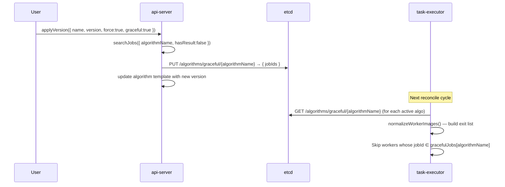
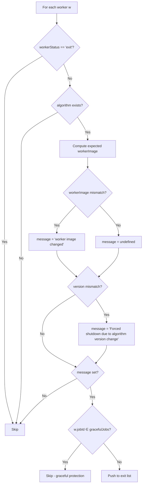

# Graceful Version Switch — Logic Contract

**Service**: `core/task-executor`  
**Feature**: Graceful algorithm version switching  
**Status**: FIXED — graceful protection applies to all exit reasons  

---

## 1. Feature Intent

When a user calls `applyVersion({ force: true, graceful: true })`, workers currently executing jobs for the affected algorithm must be allowed to **finish their current job** before being replaced. The task-executor must skip adding those workers to the exit list regardless of the exit reason.

---

## 2. Data Flow



---

## 3. State Sovereignty

| Data | Owner | Storage |
|------|-------|---------|
| Graceful job list per algorithm | api-server (writes) / task-executor (reads) | etcd: `/algorithms/graceful/{algorithmName}` |
| Algorithm template (version, image) | api-server | MongoDB via `@hkube/db` |
| Worker discovery (algorithmVersion, workerImage, jobId) | worker (self-registers) | etcd discovery |
| System versions ConfigMap (worker image tag) | Helm/deploy | Kubernetes ConfigMap |

---

## 4. Logic Contract — `normalizeWorkerImages`

**Location**: `core/task-executor/lib/reconcile/normalize.js` (line ~47)

### 4.1 Inputs

| Parameter | Type | Description |
|-----------|------|-------------|
| `normalizedWorkers` | `Object[]` | Workers from etcd discovery (normalized) |
| `algorithmTemplates` | `Object` | Keyed by `algorithmName`, contains `.version`, `.workerImage` |
| `versions` | `Object` | System versions from ConfigMap |
| `registry` | `Object` | Container registry config |
| `gracefulJobs` | `Object` | Map: `algorithmName → jobId[]` |

### 4.2 Output

Returns `Object[]` — workers that **must exit**, each annotated with a `message` string.

### 4.3 Correct Business Rules

For each worker `w` where `w.workerStatus !== 'exit'`:

1. Look up `algorithm = algorithmTemplates[w.algorithmName]`. If not found → skip (worker is orphaned).
2. Compute expected `workerImage` from algorithm template + system versions.
3. Determine exit reasons:
   - **R1**: `workerImage !== w.workerImage` → `"worker image changed"`
   - **R2**: `algorithm.version && w.algorithmVersion && algorithm.version !== w.algorithmVersion` → `"Forced shutdown due to algorithm version change"`
4. **If any exit reason applies**, check graceful protection:
   - Let `protectedJobIds = gracefulJobs[w.algorithmName] || []`
   - **If `w.jobId` is defined AND `protectedJobIds.includes(w.jobId)`** → **DO NOT EXIT** (skip this worker)
5. If not protected and any exit reason applies → push to exit list with message.

### 4.4 Decision Tree (Corrected)



---

## 5. The Bug

### Current (Broken) Logic

```
if (workerImage !== w.workerImage) {
    message = 'worker image changed';
}
if (algorithm.version && w.algorithmVersion && algorithm.version !== w.algorithmVersion) {
    // ← Graceful check is ONLY here
    if (algorithmGracefulJobs.includes(w.jobId)) return;
    message = 'Forced shutdown due to algorithm version change';
}
if (message) {
    workers.push({ ...w, message });
}
```

The graceful `return` is nested **inside** the version-mismatch block. Workers exiting for `"worker image changed"` are never checked against the graceful list.

### Failure Scenarios

| # | Scenario | Root Cause | Impact |
|---|----------|-----------|--------|
| 1 | HKube system upgrade changes worker image; algorithm version unchanged | Graceful check unreachable (inside version block) | Worker killed mid-job despite being in graceful list |
| 2 | Worker created by old code has `algorithmVersion = undefined` | Condition `algorithm.version && w.algorithmVersion` is `false` | Graceful block skipped entirely; worker killed on next image change |
| 3 | Both image AND version changed simultaneously | Image-change branch sets message, version branch could protect — but only if `w.algorithmVersion` is defined | Inconsistent: protection depends on whether old worker reports its version |

---

## 6. Corrected Logic (Pseudocode)

```js
const normalizeWorkerImages = (normalizedWorkers, algorithmTemplates, versions, registry, gracefulJobs) => {
    const workers = [];
    if (!Array.isArray(normalizedWorkers) || normalizedWorkers.length === 0) {
        return workers;
    }
    normalizedWorkers.filter(w => w.workerStatus !== 'exit').forEach((w) => {
        const algorithm = algorithmTemplates[w.algorithmName];
        if (!algorithm) return;

        const workerImage = setWorkerImage({ workerImage: algorithm.workerImage }, versions, registry);

        let message;
        if (workerImage !== w.workerImage) {
            message = 'worker image changed';
        }
        if (algorithm.version && w.algorithmVersion && algorithm.version !== w.algorithmVersion) {
            message = 'Forced shutdown due to algorithm version change';
        }

        if (message) {
            // Graceful check: protect workers whose job is in the graceful list
            const algorithmGracefulJobs = (gracefulJobs && gracefulJobs[w.algorithmName]) || [];
            if (w.jobId && algorithmGracefulJobs.includes(w.jobId)) {
                return; // protected — do not exit
            }
            workers.push({ ...w, message });
        }
    });
    return workers;
};
```

### Key Changes

1. **Graceful check moved outside** the version-mismatch block, into the `if (message)` block.
2. **Applies to ANY exit reason** — worker image change, algorithm version change, or both.
3. **Added `w.jobId` guard** — idle workers (no job assigned, `jobId = undefined`) should NOT be protected; they can be safely killed.

---

## 7. Edge Cases

| Case | `w.jobId` | `w.algorithmVersion` | Graceful List | Expected Behavior |
|------|-----------|---------------------|---------------|-------------------|
| Idle worker, image changed | `undefined` | any | any | **EXIT** — no job to protect |
| Active worker, image changed, in graceful list | `"job-123"` | any | `["job-123"]` | **SKIP** — protected |
| Active worker, version changed, in graceful list | `"job-123"` | `"v1"` | `["job-123"]` | **SKIP** — protected |
| Active worker, image changed, NOT in graceful list | `"job-456"` | any | `["job-123"]` | **EXIT** — not protected |
| Old worker without algorithmVersion, image changed, in graceful list | `"job-123"` | `undefined` | `["job-123"]` | **SKIP** — protected (image change alone triggers exit, graceful protects) |
| Worker with completed job (job finished but worker still up) | `"job-789"` | `"v1"` | `["job-789"]` | **SKIP** — still in list; cleanup happens when api-server removes jobId from graceful list |
| No graceful entry for algorithm | `"job-123"` | `"v1"` | `[]` | **EXIT** — no protection |

---

## 8. Cleanup / Lifecycle

The graceful job list is **NOT self-cleaning** in the current design. Open questions:

1. **When is a jobId removed from the graceful list?** — Currently, calling `applyVersion` with `force:true` (non-graceful) clears the list. There is no automatic cleanup when jobs complete.
2. **Stale entries**: If a job completes but the graceful entry persists, the worker would still be "protected" if it starts a new job with the same jobId (unlikely but not impossible with reuse). Mitigation: the worker would transition to idle (`jobId = undefined`) and then be killed.
3. **Recommended**: Add cleanup in `gc-service` or upon job completion event to remove completed jobIds from `/algorithms/graceful/{algorithmName}`.

---

## 9. Configuration

| Key | Source | Description |
|-----|--------|-------------|
| `/algorithms/graceful/{algorithmName}` | etcd | `{ jobIds: string[] }` — list of protected job IDs |
| `versions` ConfigMap | Kubernetes | System-wide worker/algorithm image versions |
| `algorithm.version` | MongoDB | Current desired algorithm version |

---

## 10. Fix Location

| File | Function | Line (approx) |
|------|----------|---------------|
| `core/task-executor/lib/reconcile/normalize.js` | `normalizeWorkerImages` | 47–76 |

No changes needed in `etcd.js`, `executor.js`, or `api-server`.
