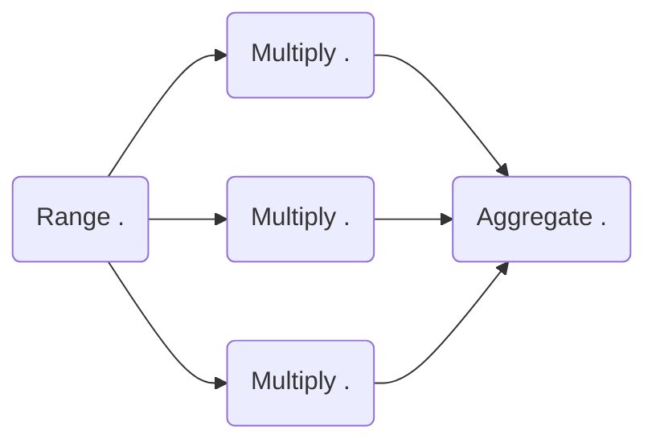

# Welcome to HKUBE

Hkube is a cloud-native open source framework to run distributed pipeline of algorithms built on Kubernetes. Hkube allows running pipelines of algorithms on Kubernetes cluster optimally utilizing the available resources, based on user priorities and AI heuristics.


# Features 

 **Distributed pipeline of algorithms** - Hkube receives input DAG graph and automatically parallelizes your algorithms(nodes) over the cluster. you can keep your code simple (even single threaded) and let Hkube worry about the complications of distributed processing.
 
  **Language Agnostic** - Hkube is a container based framework and designed to facilitate the use of any language for your algorithm
 
**Batch algorithms**  -  With Hkube you can run algorithms as a batch, multiple instances of the same algorithm in order to accelerate the running of this specific algorithm   

 **Optimize Hardware utilization** - Hkube Automatically places containers based on their resource requirements and other constraints, while not sacrificing availability. Mix critical and best-effort workloads in order to drive up utilization and save even more resources. Hkube has metrics and AI engines that help learn about your algorithm (like run-time, cpu usage, priority ..) to make efficient execution and clustering.

**Build API** -   With Hkube you can just upload your code you don't have to worry about to build containers and how to integrate with Hkube API (of course you can do it if you like) The automatic builder feature will do it all for you.

**Debugging**-   Struggling on debugging your algorithm across the cluster Hkube makes this process really easy. this process can be done by running your algorithm on your pc on your IDE while the other algorithms run on the cluster. you can also run part of the pipeline with the results from the previous running which will make the debugging much faster

**Jupiter Integration** -  hkube has integration with jupiter so you able to scale  your running on top hkube via jupiter  


## APIs
 
 
##  Pipeline descriptor 

Hkube Supports to kinds of APIs for creating pipeline:  **JSON** and **Code**
lets take a look for an example for demonstrating how the api work 



**our pipeline is built from three algorithms :**
 *for this example we send 5 as an input to the first algorithm*
 - **Range algorithm:** creating an array with a length that matches the input .     
     ``5-> [1,2,3,4,5]``
-  **Multiply algorithm:** multiples the received data from Add algorithm with the input .     
    ``[1,2,3,4,5] (2) -> [2,4,6,8,10]``
-  **Aggregate Algorithm**: the algorithm will wait until all the instances of the multiplication algorithm will finish then it will summarize the received data together .    
``[2,4,6,8,10] -> 30``


### JSON File
The pipeline descriptor is a JSON file which describes and defines the links between the nodes by defining the  dependency between them.
```JSON
{
	"name":"numbers",
	"nodes":[
		{ 
			"nodeName":"Add",
			"algorithmName":"add-algorithm",
			"input":["@flowInput.data"]
		},
		{ 
			"nodeName":"Multiply",
			"algorithmName":"multiply-algorithm",
			"input":["#@Add"]
		},
		{ 
			"nodeName":"Aggregate",
			"algorithmName":"aggregate-algorithm",
			"input":["@Multiply"]
		},
	],
	"flowInput":{
		"data":5
	}
}
```
**Hkube support three different types of special signs:**


**@** —  Defines input parameters for the algorithm .  
**#**  —  By using this in the input we can execute nodes in parallel .  
 **\*** .  
 
 
A we can see we created a pipeline with a name, numbers.  the pipeline is defined by three nodes, in Hkube, the linkage between the nodes is done by defining the algorithm inputs , for example, multiply will be run after add algorithm because of the input dependency between them. 

keep in mind that hkube will transport the results between the nodes automatically for doing it hkube currently support two different types of transportation layers *object storage* and *files system* 
the *flowInput* is the place to define the Pipeline inputs in the example above we we used  ``data:5``  but it could be anything .

theres a lot of great more features that can be define from the descriptor file

#### Other Options  (for advanched users )

```JSON  
 "webhooks": {
      "progress": "[http://my-url-to-progress](http://my-url-to-progress/)",
       "result": "[http://my-url-to-result](http://my-url-to-result/)"
     },
   "priority": 3,
   "triggers":
	   {
	    "pipelines":[],
	     "cron":{}
	   }
	"options":{
		"batchTolerance": 80,
        "concurrentPipelines": 2,
        "ttl": 3600,
        "progressVerbosityLevel":"info"
	}
```
**webhooks** - hkube has a REST api for getting the results but it support webhooks as well.  
There are two types of webhooks, *progress* and *result*. You can also fetch the same data from the REST API 
-  progress - ``{jobId}/api/v1/exec/status``
-  result -  ``{jobId}/api/v1/exec/results`` 

**priority**  -  Hkube support five level of proirities, five is the highest . those priorites with the metrics that hkube gatherd helps to decide which algorithms should be run first .
**triggers** - there two types of triggers that hkube currently support *cron* and *pipeline*
  - **cron** - Hkube can schedule your stored pipelines based on cron pattern.  
see this [cron](https://crontab.guru/) editor in order to construct your cron.
 - **pipeline** - You can set your pipelines to run each time other pipeline/s has been  finished sucssesfuly .
 
 **options** - there is even other options can be configured 
  -  **Batch Tolerance** -  The Batch Tolerance is a threshold setting that allow to control in  	 which *percent* from the batch processing the entire pipeline should be fail.
  - **Concurrency** - Pipeline Concurrency define the number of pipelines that are allowed to be running at the same time
  - **TTL** - Time to live (TTL) limits the lifetime of pipeline in the cluster. stop will be sent if pipeline running for more than ttl (in seconds).
  - **Verbosity Level** -  The Verbosity Level is a setting that allow to control what type of progress events the client will notified about.  The severity levels are ascending from least important to most important: `trace`  `debug`  `info`  `warn`  `error`  `critical`
  
  
### Algorithm
 as you probably understood the pipeline is built from algorithms which containerized with docker. 
 There are two ways to integrate your algorithm into Hkube:  
  - **Seemless Integration** - As written above hkube can build automatically your docker with the Hkube's websocket wrapper.  
-  **Code writing** -  In order to add algorithm manually to hkube you need to wrap your algorithm with hkube . hkube already has a wrappers for python,javaScript, java and .NET core.

### Seemless Integration

Now lets create the alogrithms from the numbers pipeline by our self, Hkube currently support two languages for auto build *Python* and *JavaScript* so we will those languages to create our algroithms. So we have three differnet algorithms *Range*, *Multiply* and *Aggregate*

 - **Range** - for the range algorithm we will use *Python* 
```Python
def  start(args):
	print('algorithm: start')
	input  = args['input']
	array =  range(input);
	return array
```
**Installling dependncies**
 During the contanier build, Hkube will search for the *requirment.txt* file and will try to install the packages from the pip package manager

**Advanched Operations**


 


