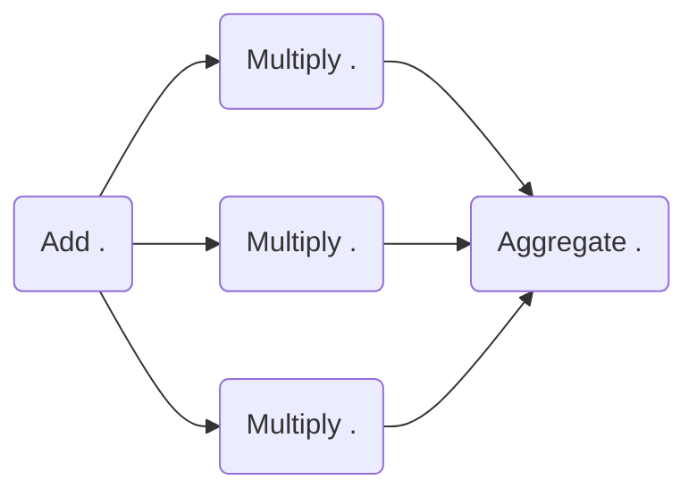

# Welcome to HKUBE

Hkube is a cloud-native open source framework to run distributed pipeline of algorithms built on Kubernetes. Hkube allows running pipelines of algorithms on Kubernetes cluster optimally utilizing the available resources, based on user priorities and AI heuristics.


# Features 

 **Distributed pipeline of algorithms** - Hkube receives input DAG graph and automatically parallelizes your algorithms(nodes) over the cluster. you can keep your code simple (even single threaded) and let Hkube worry about the complications of distributed processing.
 
  **Language Agnostic** - Hkube is a container based framework and designed to facilitate the use of any language for your algorithm
 
**Batch algorithms**  -  With Hkube you can run algorithms as a batch, multiple instances of the same algorithm in order to accelerate the running of this specific algorithm   

 **Optimize Hardware utilization** - Hkube Automatically places containers based on their resource requirements and other constraints, while not sacrificing availability. Mix critical and best-effort workloads in order to drive up utilization and save even more resources. Hkube has metrics and AI engines that help learn about your algorithm (like run-time, cpu usage, priority ..) to make efficient execution and clustering.

**Build API** -   With Hkube you can just upload your code you don't have to worry about to build containers and how to integrate with Hkube API (of course you can do it if you like) The automatic builder feature will do it all for you.

**Debugging**-   Struggling on debugging your algorithm across the cluster Hkube makes this process really easy. this process can be done by running your algorithm on your pc on your IDE while the other algorithms run on the cluster. you can also run part of the pipeline with the results from the previous running which will make the debugging much faster

**Jupiter Integration** -  hkube has integration with jupiter so you able to scale  your running on top hkube via jupiter  


## API
Hkube Supports to kinds of APIs:  **JSON** and **Code**

lets take a look for an example for demonstrating how the api work 


**our pipeline is built from three algorithms :**
 *for this example we send 5 as an input to the first algorithm*
 - **Add algorithm:** creating an array with a length that matches the input .     
     ``5-> [1,2,3,4,5]``
-  **Multiply algorithm:** multiples the received data from Add algorithm with the input .     
    ``[1,2,3,4,5] (2) -> [2,4,6,8,10]``
-  **Aggregate Algorithm**: the algorithm will wait until all the instances of the multiplication algorithm will finish then it will summarize the received data together .    
``[2,4,6,8,10] -> 30``


**Pipeline descriptor** 
	The pipeline descriptor is a JSON file which describes and defines the links between the nodes by defining the   dependency between them.
```JSON
{
	"name":"numbers",
	"nodes":[
		{ 
			"nodeName":"Add",
			"algorithmName":"add-algorithm",
			"input":["@flowInput.data"]
		},
		{ 
			"nodeName":"Multiply",
			"algorithmName":"multiply-algorithm",
			"input":["#@Add"]
		},
		{ 
			"nodeName":"Aggregate",
			"algorithmName":"aggregate-algorithm",
			"input":["@Multiply"]
		},
	],
	"flowInput":{
		"data":5
	}
}
```
**Hkube support three different types of special signs:**


**@** —  Defines input parameters for the algorithm .  
**#**  —  By using this in the input we can execute nodes in parallel .  
 **\*** .  
 
 
A we can see we created a pipeline with a name, numbers.  the pipeline is defined by three nodes, in Hkube, the linkage between the nodes is done by defining the algorithm inputs , for example, multiply will be run after add algorithm because of the input dependency between them. 

keep in mind that hkube will transport the results between the nodes automatically for doing it hkube currently support two different types of transportation layers *object storage* and *files system* 
the *flowInput* is the place to define the Pipeline inputs .
